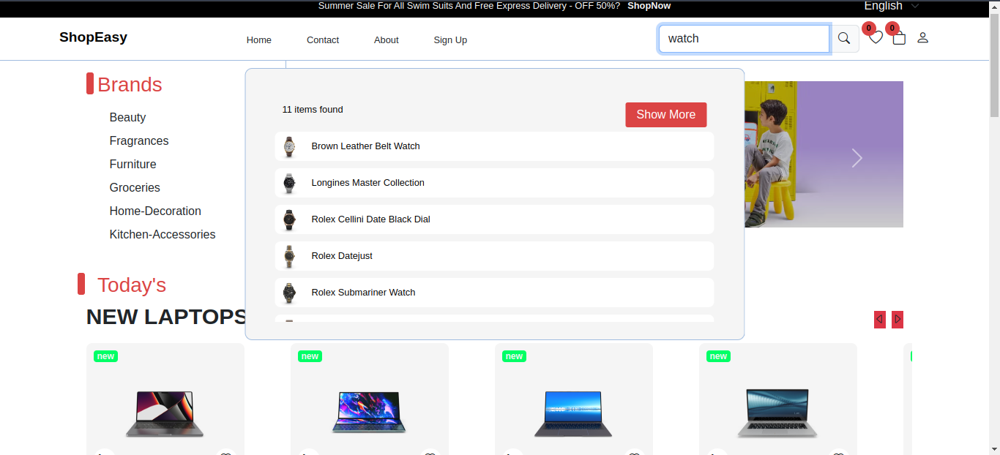
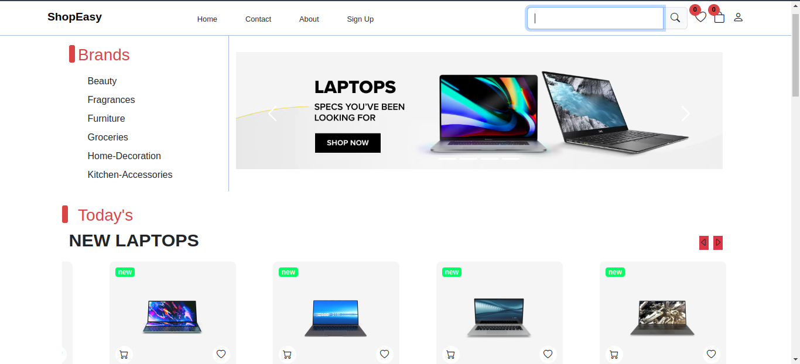
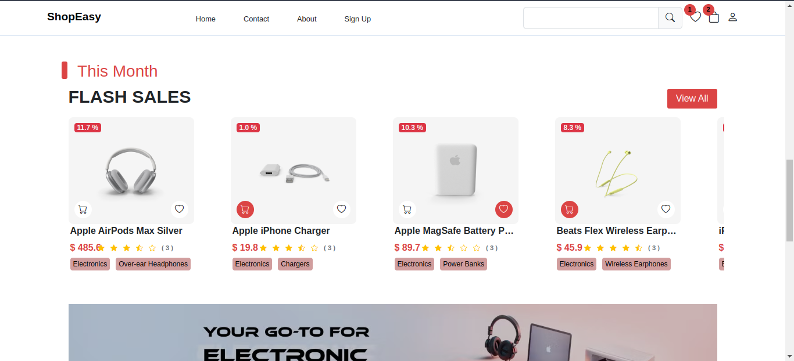

# Angular E-commerce Platform

Welcome to the Angular E-commerce Platform! This project is a comprehensive e-commerce solution built using Angular, covering essential features and advanced functionalities tailored to deliver a seamless shopping experience

## Features

- Core Features

  - Sorting & Search: Easily filter and sort products based on various criteria to find what you need quickly.
  - Add to Cart: Users can add products to their cart with ease and manage their selected items before checkout.
  - Signup & Login: Secure user authentication with the ability to create accounts, log in, and manage user profiles.
  - OTP for Sign Up: During user registration, an OTP is sent to verify the user's phone number, ensuring secure account creation.

- Upcomming Features

  - API Integration: Connect with external APIs to fetch and display product data dynamically.
  - Password Management: Users can set and manage their passwords securely, with validation and feedback mechanisms.
  - Guards for Authentication: Implemented route guards to restrict access to specific pages for unauthenticated users, ensuring secure interactions.
  - Multiple Addresses: Users can add and manage multiple shipping addresses using array forms, allowing for flexible order management.
  - Multiple Phone Numbers: Similar to addresses, users can add and manage multiple phone numbers for contact preferences.
  - Admin Side: Admins have a dedicated interface to add new products, manage existing ones, and oversee the platform's inventory.

  This project was generated with [Angular CLI](https://github.com/angular/angular-cli) version 18.1.3.

## 

## 

## 
